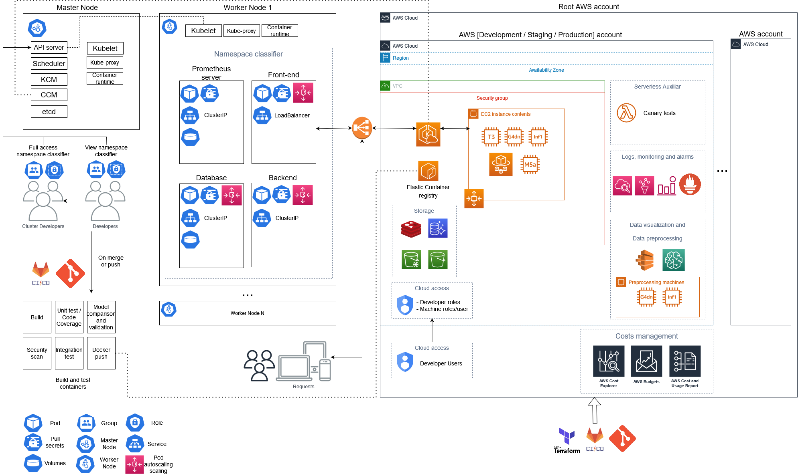
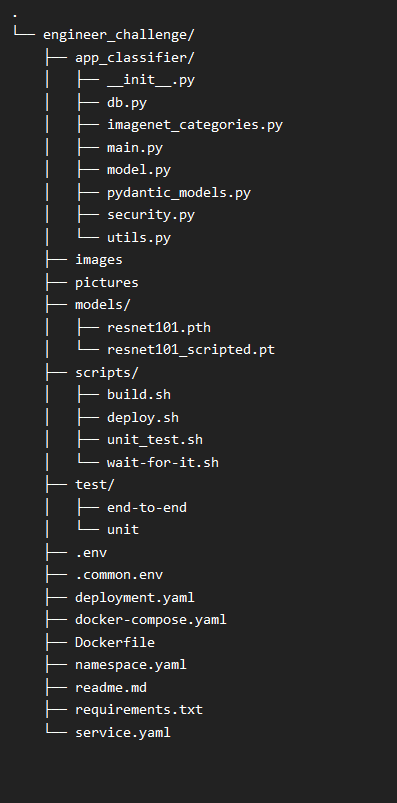

# Classifier mock exercise


This project launches a basic fastAPI sever which is used to classify images passed through the API. 




# Requirements

This project requires:

    - Minikube (tested on v1.27.1)

    - Docker (tested on v20.10.16)

    - Kubectl

Minikube used *virtualbox* as driver to create the VMs. The following command was used to launch the cluster: `minikube start --no-vtx-check --driver=virtualbox`

Inside the containers it runs Python3.9 with multiple requirements which can be seen within the file requirements.txt 
It uses libraries such as pytorch, torchvision, PIL, fastAPI, pytest or bcrypt.

# Execution

The services provided by this project are executed on top of fastAPI. It has two main functionalities: The first one gets 
an authentication token; the second one executes inferences over a resnet classifier. The second part requires an image
and the authentication token to perform the inference, while the first part just needs the username and a password to authenticate. This project can used locally run locally and be deployed on minikube. It can also run unit test and end-to-end tests. 

To run the project locally please execute the file `.scripts/build.sh` . It runs a docker compose with all the required 
steps to run the fastAPI server. The server runs on localhost:8000. 

To run unit-tests please execute the file `.scripts/unit_test.sh`. This file runs a docker-compose with the project and it executes different unit-tests over the project. Some of these tests are *xfails* and they are meant to fail.

To deploy the project into minikube please execute the file `.scripts/deploy.sh`. It generates the docker container, launches the minikube server, loads the image within minikube and launches the deployment and service within a created namespace. Please retrieve the service IP and run it through the port 8000.

For security and versioning reasons, notice that running the docker container by itself will not work given that the environment variables are stored within the docker compose and the deployment.yaml.

# Usage and expected output

There is a two step process to start performing inferences over the model. The first steps is a mock authentification and the second step is the prediction itself. This mock authentification contains one unique user that can perform predictions. 
This authentication is performed through the post api **/token**. This service takes information of the user, validates it and returns a token in which will be used to authenticate the predictions. Since this is a mock authentification, the token do not expire overtime.  

The users credentials are:
    
    - username: client_user
    - password: tryClassifier

To authenticate the user please execute:

`curl -X 'POST' \
  'http://localhost:8000/token' \
  -H 'accept: application/json' \
  -H 'Content-Type: application/x-www-form-urlencoded' \
  -d 'grant_type=&username=client_user&password=tryClassifier&scope=&client_id=&client_secret='`

If you prefer to execute it through Python3:

```
import requests
import json

r = requests.post('http://localhost:8000/token',
                      headers={'accept': 'application/json', 'Content-Type': 'application/x-www-form-urlencoded'},
                      data='grant_type=&username=client_user&password=tryClassifier&scope=&client_id=&client_secret=')
                      
token_information = json.loads(r.content)
print(token_information)

```
The result of this step is a dictionary similar to the following one:
```commandline
{
  "access_token": "eyJhbGc*************************",
  "token_type": "bearer"
}
```


Once the token is retrieved, we can perform inferences using the service from /predict. This API takes an image and the token and it returns a JSON with the results (if the image is valid).

To execute one prediction run:

`
curl -X 'POST' \
  'http://localhost:8000/predict' \
  -H 'accept: application/json' \
  -H 'Authorization: Bearer ${retrieve_token}' \
  -H 'Content-Type: multipart/form-data' \
  -F 'file=@chairs.jpg;type=image/jpeg'
`

If you prefer to execute it through Python3:

```
import requests
import json

files = {'file': open(image, 'rb'),
             'Content-Type': 'image/jpeg',
            'filename': image}
hed = {'Authorization': 'Bearer ' + retrieve_token,
       'accept': 'application/json'}
r = requests.post('http://localhost:8000/predict', headers=hed, files=files)
results = json.loads(r.content)
print(results)
```

In both cases retrieve_token is the token obtained from the authentication step. (HINT: if you are not able to retrieve the token, it can be found through in different places through the project given that the authentication is just a mock version).

The output expected from the execution is a similar dictionary in case of a succesful inference:
```commandline
{
  "username": "client_user",
  "filename": "chairs.jpg",
  "extension": "jpg",
  "date": "2022-11-06T16:09:34.895476",
  "class_id": 532,
  "category_name": "dining table",
  "score": 74,
  "success": true
}
```

In case of failure, it returns a string similar to:
`{
  "detail": "something went wrong, please check the extension or the validity of the image.More details: username='client_user' filename='dummy_not_image.py' extension='py' date=datetime.datetime(2022, 11, 6, 16, 18, 30, 587351) class_id=None category_name=None score=None success=False"
}`

# Project structure




This section will provide a brief overview of the different components of the project. The core project is build within the folder **app_classifier**. This folder contain files that defines required functions and classes to launch the project:


    1. main.py : Provides the api definitions 
    2. model.py : Declares a class of the torch model. It can load models in eager or script mode.
    3. security.py : Validates users and passwords, encodes tokens and decodes users.
    4. utils.py : Reads images and transforms different kinds of data (from tensor results to dictionaries or dictionaries into pydantic classes)
    5. pydantic_models.py: Declares different dataclasses which are used through the project.
    6. db.py: Imitates requests of users and storage of logs.
    7. imagenet_categories.py: Contains labels of the classifier. This file is redundant since the models itself (the ones from this project) already contains the labels within.

Besides app_classifier, there are also all the unit-test and end-to-end tests. Those uses Pytest as main framework and are executed through `scripts/unit-test.sh`.

There is also *.env* and *commmon.env* which are used in conjuntion with docker-compose.yaml and the Dockerfile to create the basic local deployments and tests.

Finally, *deployment.yaml*, *services.yaml* and *namespace.yaml* are used to launch the kubernetes server.


# Missing parts and things to notice

1 - Given time restrictions, there is no dabatase backing this project. Despite that, a logging dataclass has been created in which tries to store the successful or
unsuccesful results of the inferences (executing on the background).

2 - Given time restrictions, there is also no any kind of logging or monitoring in place.

3 - The whole project was ran on a machine with only a CPU. The scripted torch model can only run in CPU since it was compiled without CUDA.

4 - There are test cases which should fail market as xfail.

5 - There is a script called `wait-for-it.sh` which is used for the end-to-end testing which waits for the fastapi container to spin up.


# Further Documentation

For further documentation please run locally the project and access to http://localhost:8000/docs or read the comments from the different functions and classes.
 
# Others - Choosen technologies

I choose fastAPI given its easy implementation, speed, easy documentation, familiarity and time restrictions. I wanted to learn TorchServe and use it on the 2.2 point but 
given the schedule provided there were other priorities within other points of the project.
